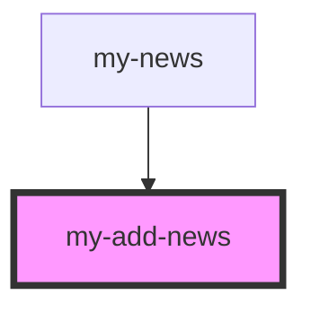

# my-add-news

<!-- Auto Generated Below -->

## Properties

| Property | Attribute | Description | Type     | Default     |
| -------- | --------- | ----------- | -------- | ----------- |
| `body`   | `body`    |             | `string` | `undefined` |
| `title`  | `title`   |             | `string` | `undefined` |

## Events

| Event       | Description | Type               |
| ----------- | ----------- | ------------------ |
| `newsAdded` |             | `CustomEvent<any>` |

## Dependencies

### Used by

 - [my-news](../my-news)

### Graph

----------------------------------------------

*Built with [StencilJS](https://stenciljs.com/)*
