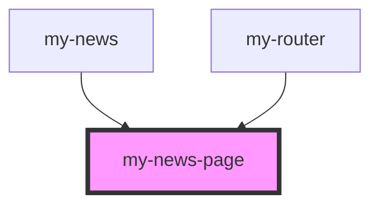

# my-news-page

<!-- Auto Generated Below -->

## Properties

| Property | Attribute | Description | Type     | Default     |
| -------- | --------- | ----------- | -------- | ----------- |
| `news`   | `news`    |             | `any`    | `undefined` |
| `page`   | `page`    |             | `string` | `undefined` |

## Events

| Event         | Description | Type               |
| ------------- | ----------- | ------------------ |
| `newsDeleted` |             | `CustomEvent<any>` |

## Dependencies

### Used by

 - [my-news](../my-news)
 - [my-router](../my-router)

### Graph

----------------------------------------------

*Built with [StencilJS](https://stenciljs.com/)*
